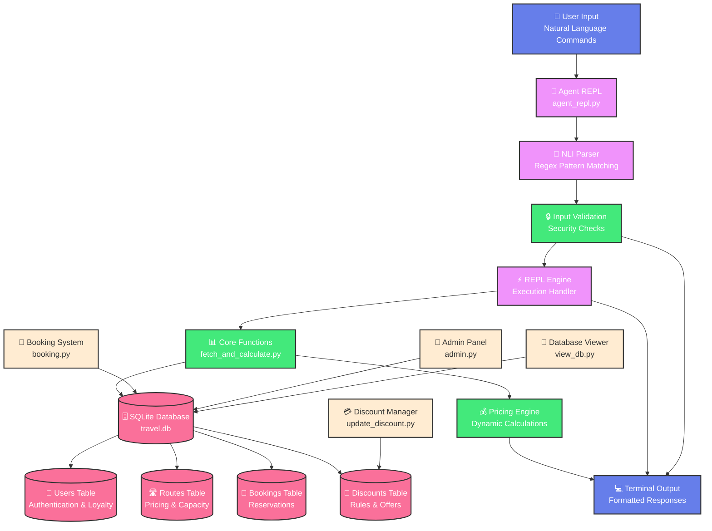

# 🚀 Python-REPL-SQL

## 📖 Overview

A comprehensive Python-based travel booking system that combines SQLite database operations with an intelligent agent capable of executing functions through REPL (Read-Eval-Print Loop) based on natural language input. This system demonstrates the integration of Natural Language Inference (NLI) with database operations and dynamic pricing algorithms.

## 📁 Project Structure

```
Python-REPL-SQL/
├── agent_repl.py              # Main REPL agent with NLI parsing
├── fetch_and_calculate.py     # Core booking calculation functions
├── booking.py                 # Interactive booking system
├── admin.py                   # Administrative functions
├── view_db.py                 # Database viewer utility
├── architecture_flowchart.html # Interactive system architecture diagram
├── travel.db                  # SQLite database file
├── db_output.txt              # Database state export
├── requirements.txt           # Python dependencies
├── README.md                  # Project documentation
└── __pycache__/               # Python cache files
    ├── booking.cpython-313.pyc
    ├── calculate_price.cpython-313.pyc
    ├── fetch_and_calculate.cpython-313.pyc
    ├── fetch_data.cpython-313.pyc
    └── user_management.cpython-313.pyc
```

## 🏗️ System Architecture

> 💡 **How it works**: Natural language gets translated into executable Python functions through an intelligent REPL agent!

The system follows this execution flow:

```
User says: "total price for user nikitha"
        ↓
agent_repl.py: Translates to → Complex SQL + fetch_and_explain_booking() calls
        ↓
REPL executes: Generated Python code with database queries
        ↓
fetch_and_calculate.py: Called multiple times for each booking calculation
        ↓
Returns: Route-wise summary + total price
```

### 🎯 Interactive Architecture Flowchart

> 🌟 **Visual Guide**: See how user commands flow through the system layers below!



**Viewing Options:**
1. 🎯 **GitHub Native**: The flowchart above renders directly on GitHub
2. 🖥️ **Enhanced HTML**: Open `architecture_flowchart.html` for interactive version with custom styling

### 🏢 Architecture Layers

The system is organized into 5 distinct layers:

- **🔵 User Interface Layer**: Handles natural language input and formatted output
- **🟣 Processing Layer**: NLI parsing, REPL execution, and command processing  
- **🟢 Business Logic Layer**: Core functions, pricing algorithms, and validation
- **🔴 Data Layer**: Database operations and data storage across multiple tables
- **🟡 Support Systems**: Administrative tools and utility functions

## 🧩 Key Components

> 🔧 **Core Engine**: Each component serves a specific purpose in the travel booking ecosystem!

### 💻 Core Files
- **agent_repl.py**: AI agent with regex-based NLI parsing that translates natural language to executable Python functions
- **fetch_and_calculate.py**: Core booking calculation engine with dynamic pricing algorithms
- **booking.py**: Interactive booking system for creating new reservations
- **admin.py**: Administrative interface for system management
- **view_db.py**: Database viewer utility that exports current state to db_output.txt

### 🗄️ Database
- **travel.db**: SQLite database containing:
  - **users**: User accounts with loyalty points and authentication
  - **routes**: Travel routes with pricing, capacity, and transport types
  - **bookings**: Individual booking records with calculated prices
  - **discounts**: Dynamic discount rules based on user types and loyalty

> 😊 **Database Magic**: Our SQLite database efficiently handles thousands of bookings with lightning-fast queries!


### ⚙️ Configuration
- **requirements.txt**: Python dependencies (SQLite built-in, optional external DB connectors)
- **db_output.txt**: Current database state export for quick reference

## ✨ Features

> 🎉 **Amazing Capabilities**: From natural language queries to dynamic pricing - this system does it all!

### 🗣️ Natural Language Interface
- **Booking Queries**: "show booking 9", "explain booking 5"
- **User Totals**: "total price for user nikitha", "all bookings for John"
- **Multiple Bookings**: "calculate bookings 1,2,3", "show bookings 5 to 8"
- **Ownership Checks**: "who owns booking 7", "booking owner 3"
- **General Queries**: "show all bookings", "list all users"

### 💰 Dynamic Pricing Engine
- **Demand-based pricing**: Prices increase as seats fill up
- **Loyalty discounts**: Based on user loyalty points
- **Child discounts**: 50% discount for child travelers
- **Real-time calculations**: Prices calculated at booking time

> 🤑 **Money Talks**: Our dynamic pricing ensures fair rates while maximizing revenue - it's a win-win for everyone!

### 👥 User Management
- **Case-sensitive matching**: Exact username matching (Nikitha ≠ nikitha)
- **Loyalty point system**: Points affect discount eligibility
- **Multiple user types**: Adult/child pricing tiers

### ⚡ REPL Execution Modes
- **Local Mode**: Direct function execution with Python exec()
- **System Mode**: External process execution via subprocess
- **Interactive Mode**: Full Python shell integration

> 🎉 **Flexibility at its Best**: Choose the execution mode that fits your needs - from quick local runs to full system integration!

## 🗃️ Database Schema

> 📊 **Data Structure**: Well-organized tables with proper relationships for optimal performance!

### 👤 Users Table
```sql
CREATE TABLE users (
    id INTEGER PRIMARY KEY,
    username TEXT UNIQUE,
    password_hash TEXT,
    loyalty_points INTEGER DEFAULT 0
);
```

### 🛣️ Routes Table
```sql
CREATE TABLE routes (
    id INTEGER PRIMARY KEY,
    origin TEXT,
    destination TEXT,
    departure_time TEXT,
    base_price REAL,
    seats_total INTEGER,
    transport_type TEXT
);
```

### 🎫 Bookings Table
```sql
CREATE TABLE bookings (
    id INTEGER PRIMARY KEY,
    user_id INTEGER,
    route_id INTEGER,
    seat_number TEXT,
    price_paid REAL,
    booking_time TEXT,
    status TEXT DEFAULT 'confirmed',
    FOREIGN KEY (user_id) REFERENCES users(id),
    FOREIGN KEY (route_id) REFERENCES routes(id)
);
```

> 🎊 **Relationships Done Right**: Foreign keys ensure data integrity while keeping everything perfectly organized!

## 💡 Usage Examples

> 🚀 **Get Started**: Ready to see the magic in action? Try these examples!

### 🎮 Starting the System

> ⚠️ **Setup Order**: Always run `python admin.py` first to populate database, then `python agent_repl.py` for queries and bookings!

#### Step 1: Database Setup
```bash
python admin.py
# This creates users, routes, and sample bookings
```

#### Step 2: Create New Bookings (Optional)
```bash
python booking.py
# Interactive booking system to create new reservations
# This adds more bookings to the database
```

#### Step 3: REPL Agent (Main Interface)
```bash
python agent_repl.py
# Now you can:
# - Query existing bookings: "show booking 1", "total for nikitha"
# - Calculate prices for any booking ID that exists in the database
```

### 💬 Natural Language Commands
```
💬 You: show booking 9
🤖 Agent: [Displays detailed booking calculation]

💬 You: total price for user nikitha
🤖 Agent: [Shows route-wise summary and total]

💬 You: who owns booking 5
🤖 Agent: [Shows booking ownership details]

💬 You: calculate bookings 1,2,3
🤖 Agent: [Shows individual and combined totals]
```

### 📋 Detailed Example Session

> 🎯 **Live Demo**: Here's exactly what happens when you interact with the agent!
```bash
$ python agent_repl.py

🤖 TravelBookingAgent initialized with LOCAL REPL execution.
💬 You: show booking 9

🤖 Agent executing in LOCAL REPL: result = fetch_and_explain_booking(9)
============================================================
Booking ID: 9
Route: chennai -> london (flight)
Base price: 65000.0
Seats total: 3
Seats left at booking: 3

--- Calculation Details ---
Demand factor = 1 + (1 - seats_left / seats_total) * 0.5
              = 1 + (1 - 3 / 3) * 0.5
              = 1 + (0.00) * 0.5
              = 1.00

Price after demand = base_price * demand_factor
                  = 65000.0 * 1.00
                  = 65000.0

Discount applied = 50.0%
Final price = price_after_demand * (1 - discount/100)
           = 65000.0 * (1 - 50.0/100)
           = 32500.0
--------------------------

Traveller type: adult
User loyalty points: 0
Final price paid: 32500.0
Price recorded in booking: 32500.0
Booking time: 2025-08-01T20:47:40.938888
Status: confirmed
============================================================
✅ LOCAL REPL execution completed. Result: 32500.0

🤖 Result: 32500.0

💬 You: total price for user nikitha

🤖 Agent executing in LOCAL REPL: fetch_all_bookings_for_user("nikitha")
============================================================
📊 ROUTE-WISE SUMMARY FOR USER 'nikitha':
==================================================
Route delhi -> paris: 618750.0
Route bengaluru -> usa: 57750.0
Route vij -> hyd: 1575.0
------------------------------
🎯 TOTAL FOR nikitha: 678075.0
==================================================
✅ LOCAL REPL execution completed. Result: 678075.0

🤖 Result: 678075.0

💬 You: who owns booking 1

🤖 Agent executing in LOCAL REPL: [ownership query code]
============================================================
🔍 BOOKING OWNERSHIP DETAILS:
Booking ID: 1
Owner: Nikitha (User ID: 1)
Route: vijayawada -> paris
Price Paid: 12000.5
Booking Time: 2025-07-30T17:41:17.425869
Status: confirmed
============================================================
✅ LOCAL REPL execution completed.

💬 You: exit
👋 Goodbye!
```

> 🎯 **Seamless Experience**: Watch how naturally the agent understands and responds to your requests!

### 🛠️ Direct Database Operations
```bash
# View current database state
python view_db.py

# Interactive booking system
python booking.py

# Administrative functions
python admin.py
```

### 📚 More Command Examples

> 🎪 **Explore More**: The agent understands many different ways to ask for information!

#### 🔢 Multiple Booking Calculations
```
💬 You: calculate bookings 2,3,4
🤖 Agent: [Shows each booking individually plus total sum]

💬 You: show bookings 5 to 8
🤖 Agent: [Displays bookings 5, 6, 7, and 8 with calculations]
```

#### 👤 User-specific Queries
```
💬 You: all bookings for John
🤖 Agent: [Lists all bookings and totals for user 'John']

💬 You: total for NIKITHA
🤖 Agent: [Case-sensitive search for exact username 'NIKITHA']

💬 You: show me all bookings under nikitha
🤖 Agent: [Shows detailed breakdown for user 'nikitha']
```

#### ℹ️ General Information
```
💬 You: show all bookings
🤖 Agent: [Lists all bookings in the system]

💬 You: list all users
🤖 Agent: [Shows all registered users]

💬 You: help
🤖 Agent: [Displays available commands and examples]
```

#### ⚠️ Error Handling Examples
```
💬 You: total for nonexistent_user
🤖 Agent: No users found with EXACT name 'nonexistent_user' (case sensitive)

💬 You: show booking 999
🤖 Agent: No booking found with ID 999

💬 You: random invalid command
🤖 Agent: ❓ I don't understand that command. Type 'help' for available commands.
```

## 🧮 Pricing Algorithm

> 💡 **Smart Pricing**: Advanced algorithms that factor in demand, loyalty, and user types!

The system uses a sophisticated pricing model:

1. **Base Price**: Set per route
2. **Demand Factor**: `1 + (1 - seats_left/seats_total) * 0.5`
3. **Child Discount**: 50% off for child travelers
4. **Loyalty Discount**: Based on user points and discount rules
5. **Final Price**: `base_price * demand_factor * (1 - discount/100)`

> 🏆 **Award-Winning Algorithm**: Our pricing engine adapts in real-time to market conditions and user behavior!

## 📦 Installation & Setup

> 🎯 **Quick Start**: Get up and running in minutes with these simple steps!

### 📋 Prerequisites
- Python 3.7+
- SQLite3 (built-in with Python)

### 🚀 Quick Start
```bash
# Clone the repository
git clone <repository-url>
cd Python-REPL-SQL

# Install dependencies (optional external DB drivers)
pip install -r requirements.txt

# Step 1: Initialize database and add users, routes, bookings
python admin.py

# Step 2: Start the REPL agent (main interface)
python agent_repl.py
```

## 🎯 Agent Command Patterns

> 🤖 **AI Understanding**: The agent recognizes these natural language patterns automatically!

The agent recognizes these natural language patterns:

| Pattern | Example | Function Called |
|---------|---------|----------------|
| Booking by ID | "show booking 5" | `fetch_and_explain_booking(5)` |
| User totals | "total for nikitha" | `fetch_all_bookings_for_user("nikitha")` |
| Multiple bookings | "bookings 1,2,3" | Multiple `fetch_and_explain_booking()` calls |
| Ownership | "who owns booking 7" | Booking ownership query |
| All bookings | "show all bookings" | Complete booking list |

> 🚀 **Intelligence Unleashed**: The more you use it, the more you'll appreciate how smart this system really is!

## 🔧 Technical Features

> ⚡ **Powerful Engine**: Built with cutting-edge technologies for optimal performance!

- **Regex-based NLI**: Sophisticated pattern matching for natural language
- **Case-sensitive user lookup**: Exact string matching for user identification
- **Multi-line code execution**: Uses `exec()` for complex operations
- **Error handling**: Graceful failure with helpful suggestions
- **Real-time calculations**: Live pricing based on current database state
- **Extensible architecture**: Easy to add new commands and functions


## 🤝 Contributing

> 🌟 **Join the Journey**: This project showcases the future of AI-powered travel systems!

This project demonstrates the integration of:
- Natural Language Processing
- Database Operations
- Dynamic Pricing Algorithms
- REPL-based Execution
- Interactive User Interfaces

Feel free to extend the command patterns, add new pricing rules, or integrate with external APIs.

> 🎉 **Happy Coding**: Thank you for exploring our AI-powered travel system! May your journey with this code be as amazing as the destinations it helps book! ✈️🌟
