# 🚀 Travel Booking System with AI Agent

## 📖 Overview

A comprehensive Python-based travel booking system that combines a modern Streamlit web interface with an int### 🏢 Architecture Layers

The system is organized into 6 distinct layers:

- **🔵 User Interface Layer**: Handles user input through web browser or command line
- **🟣 Web Application Layer**: Streamlit interface with chat, admin panel, and dashboard
- **🟢 Processing Layer**: NLI parsing, REPL execution, and command processing  
- **🟡 Business Logic Layer**: Core functions, pricing algorithms, validation, and booking workflow
- **🔴 Data Layer**: Database operations and data storage across multiple tables
- **🟤 Support Systems**: Administrative tools, utilities, and launchersI agent capable of executing functions through REPL (Read-Eval-Print Loop) based on natural language input. This system demonstrates the integration of Natural Language Inference (NLI) with database operations, dynamic pricing algorithms, and a complete booking workflow.

## 📁 Project Structure

```
AgentRepl/
├── 🌐 WEB APPLICATION
│   ├── streamlit_app.py           # Main Streamlit web application
│   ├── run_app.bat               # Windows batch launcher
│   └── run_app.py                # Python application launcher
│
├── 🤖 AI AGENT & CORE
│   ├── agent_repl.py             # AI agent with NLI parsing
│   ├── fetch_and_calculate.py    # Core booking calculation functions
│   └── test_agent.py             # Agent testing utilities
│
├── 💼 BOOKING & MANAGEMENT
│   ├── booking.py                # Interactive booking system
│   ├── admin.py                  # Administrative functions
│   ├── add_route.py              # Route management utility
│   └── update_discount.py        # Discount management
│
├── 🔍 DATABASE UTILITIES
│   ├── view_db.py                # Database viewer utility
│   ├── check_db.py               # Database validation tool
│   └── travel.db                 # SQLite database file
│
├── 📋 CONFIGURATION & DOCS
│   ├── requirements.txt          # Python dependencies
│   ├── README.md                 # Project documentation
│   └── db_output.txt             # Database state export
│
└── 📦 CACHE
    └── __pycache__/              # Python cache files
        ├── agent_repl.cpython-*.pyc
        ├── booking.cpython-*.pyc
        ├── fetch_and_calculate.cpython-*.pyc
        └── streamlit_app.cpython-*.pyc
```

## 🏗️ System Architecture

> 💡 **How it works**: Natural language gets translated into executable Python functions through an intelligent REPL agent!

The system follows this execution flow:

```
User says: "total price for user nikitha" ← 📖 READ
        ↓
agent_repl.py: Translates to → Complex SQL + fetch_and_explain_booking() calls ← ⚙️ EVAL
        ↓
REPL executes: Generated Python code with database queries ← ⚡ EVAL
        ↓
fetch_and_calculate.py: Called multiple times for each booking calculation ← 📊 EVAL
        ↓
Returns: Route-wise summary + total price ← 📄 PRINT
        ↓
Ready for next natural language command ← 🔁 LOOP
```

### 🎯 Interactive Architecture Flowchart

> 🌟 **Visual Guide**: See how user commands flow through the system layers below!

```mermaid
flowchart TD
    %% User Interface Layer
    USER[👤 User Input<br/>Web Browser/CLI]
    WEB_UI[🌐 Web Interface<br/>Streamlit Dashboard]
    CHAT[💬 Chat Interface<br/>Booking Assistant]
    TERMINAL[💻 CLI Output<br/>Terminal Responses]
    
    %% Core Processing Engine  
    STREAMLIT_APP[🚀 Streamlit App<br/>streamlit_app.py]
    AGENT[🤖 Agent REPL<br/>agent_repl.py]
    NLI[🧠 NLI Parser<br/>Regex Pattern Matching]
    REPL[⚡ REPL Engine<br/>Execution Handler]
    
    %% Business Logic Layer
    CORE[📊 Core Functions<br/>fetch_and_calculate.py]
    PRICING[💰 Pricing Engine<br/>Dynamic Calculations]
    VALIDATION[🔒 Input Validation<br/>Security Checks]
    BOOKING_LOGIC[🎫 Booking Logic<br/>Multi-step Workflow]
    
    %% Data Layer
    DATABASE[(🗄️ SQLite Database<br/>travel.db)]
    USERS[(👥 Users Table<br/>Authentication & Loyalty)]
    ROUTES[(🛣️ Routes Table<br/>Pricing & Capacity)]
    BOOKINGS[(🎫 Bookings Table<br/>Reservations)]
    DISCOUNTS[(💸 Discounts Table<br/>Rules & Offers)]
    
    %% Supporting Systems
    BOOKING[📝 CLI Booking<br/>booking.py]
    ADMIN[🔧 Admin Panel<br/>admin.py]
    VIEWER[👀 Database Viewer<br/>view_db.py]
    DISCOUNT_MGR[💳 Discount Manager<br/>update_discount.py]
    ROUTE_MGR[🛣️ Route Manager<br/>add_route.py]
    CHECKER[🔍 Database Checker<br/>check_db.py]
    LAUNCHER[🚀 App Launcher<br/>run_app.bat/.py]
    
    %% PRIMARY WEB INTERFACE FLOW
    USER --> LAUNCHER
    LAUNCHER --> STREAMLIT_APP
    STREAMLIT_APP --> WEB_UI
    STREAMLIT_APP --> CHAT
    STREAMLIT_APP --> ADMIN
    
    %% CHAT BOOKING FLOW
    CHAT --> BOOKING_LOGIC
    BOOKING_LOGIC --> VALIDATION
    VALIDATION --> PRICING
    PRICING --> DATABASE
    
    %% REPL INTEGRATION FLOW
    CHAT --> AGENT
    AGENT --> NLI
    NLI --> REPL
    REPL --> CORE
    CORE --> DATABASE
    
    %% CLI ALTERNATIVE FLOW
    USER --> AGENT
    AGENT --> TERMINAL
    USER --> BOOKING
    USER --> ADMIN
    
    %% DATABASE CONNECTIONS
    DATABASE --> USERS
    DATABASE --> ROUTES  
    DATABASE --> BOOKINGS
    DATABASE --> DISCOUNTS
    
    %% SUPPORTING SYSTEM CONNECTIONS
    STREAMLIT_APP --> DATABASE
    BOOKING --> DATABASE
    ADMIN --> DATABASE
    VIEWER --> DATABASE
    DISCOUNT_MGR --> DISCOUNTS
    ROUTE_MGR --> ROUTES
    CHECKER --> DATABASE
    
    %% RESPONSE FLOWS
    DATABASE --> PRICING
    PRICING --> CHAT
    CORE --> TERMINAL
    BOOKING_LOGIC --> CHAT
    
    %% Styling
    classDef userLayer fill:#667eea,stroke:#333,stroke-width:2px,color:#fff
    classDef webLayer fill:#f093fb,stroke:#333,stroke-width:2px,color:#fff
    classDef processingLayer fill:#43e97b,stroke:#333,stroke-width:2px,color:#fff
    classDef businessLayer fill:#ffeaa7,stroke:#333,stroke-width:2px,color:#333
    classDef dataLayer fill:#fa709a,stroke:#333,stroke-width:2px,color:#fff
    classDef supportLayer fill:#ffecd2,stroke:#333,stroke-width:2px,color:#333
    
    class USER userLayer
    class WEB_UI,CHAT,STREAMLIT_APP webLayer
    class AGENT,NLI,REPL,TERMINAL processingLayer
    class CORE,PRICING,VALIDATION,BOOKING_LOGIC businessLayer
    class DATABASE,USERS,ROUTES,BOOKINGS,DISCOUNTS dataLayer
    class BOOKING,ADMIN,VIEWER,DISCOUNT_MGR,ROUTE_MGR,CHECKER,LAUNCHER supportLayer
```



**Viewing Options:**
1. 🎯 **GitHub Native**: The flowchart above renders directly on GitHub
2. 🖥️ **Enhanced HTML**: Open `architecture_flowchart.html` for interactive version with custom styling

### 🏢 Architecture Layers

The system is organized into 6 distinct layers:

- **🔵 User Interface Layer**: Handles user input through web browser or command line
- **🟣 Web Application Layer**: Streamlit interface with chat, admin panel, and dashboard
- **� Processing Layer**: NLI parsing, REPL execution, and command processing  
- **� Business Logic Layer**: Core functions, pricing algorithms, validation, and booking workflow
- **🔴 Data Layer**: Database operations and data storage across multiple tables
- **� Support Systems**: Administrative tools, utilities, and launchers

## 🧩 Key Components

> 🔧 **Core Engine**: Each component serves a specific purpose in the travel booking ecosystem!

### 💻 Core Files
- **streamlit_app.py**: Modern web application with chat interface, admin panel, and booking system
- **agent_repl.py**: AI agent with regex-based NLI parsing that translates natural language to executable Python functions
- **fetch_and_calculate.py**: Core booking calculation engine with dynamic pricing algorithms
- **booking.py**: Interactive CLI booking system for creating new reservations
- **admin.py**: Administrative interface for system management

### 🛠️ Management Tools
- **add_route.py**: Route management utility for adding and updating travel routes
- **update_discount.py**: Discount management system for creating and modifying discount rules
- **check_db.py**: Database validation and integrity checking tool
- **test_agent.py**: Testing utilities for agent functionality validation

### 🚀 Application Launchers
- **run_app.bat**: Windows batch file for easy application startup
- **run_app.py**: Python launcher script for cross-platform compatibility

### 🔍 Database Utilities
- **view_db.py**: Database viewer utility that exports current state to db_output.txt

### 🗄️ Database
- **travel.db**: SQLite database containing:
  - **users**: User accounts with loyalty points, authentication, and session data
  - **routes**: Travel routes with pricing, capacity, transport types, and real-time availability
  - **bookings**: Individual booking records with calculated prices, timestamps, and status
  - **discounts**: Dynamic discount rules based on user types, loyalty points, and special offers

> 😊 **Database Magic**: Our SQLite database efficiently handles thousands of bookings with lightning-fast queries!


### ⚙️ Configuration
- **requirements.txt**: Python dependencies including Streamlit for web interface
- **db_output.txt**: Current database state export for quick reference
- **travel.db**: Main SQLite database with users, routes, bookings, and discounts tables

## ✨ Features

> 🎉 **Amazing Capabilities**: From natural language queries to dynamic pricing - this system does it all!

### 🌐 Modern Web Interface
- **Streamlit Web App**: Complete travel booking system with professional UI
- **Chat-based Booking**: Conversational interface for natural booking experience
- **Real-time Pricing**: Dynamic price calculation with instant feedback
- **Admin Dashboard**: Web-based administration with database management
- **User Authentication**: Secure login system with session management
- **Discount System**: Advanced discount application with loyalty points

### 🗣️ Natural Language Interface
- **Booking Queries**: "show booking 9", "explain booking 5"
- **User Totals**: "total price for user nikitha", "all bookings for John"
- **Multiple Bookings**: "calculate bookings 1,2,3", "show bookings 5 to 8"
- **Ownership Checks**: "who owns booking 7", "booking owner 3"
- **General Queries**: "show all bookings", "list all users"

### 💰 Dynamic Pricing Engine
- **Demand-based pricing**: Prices increase as seats fill up
- **Loyalty discounts**: Based on user loyalty points
- **Child discounts**: 50% discount for child travelers
- **Real-time calculations**: Prices calculated at booking time

> 🤑 **Money Talks**: Our dynamic pricing ensures fair rates while maximizing revenue - it's a win-win for everyone!

### 🎫 Complete Booking Workflow
- **Smart Route Search**: Intelligent origin/destination matching
- **Dynamic Seat Management**: Real-time availability tracking
- **Multi-step Booking**: Guided process from login to confirmation
- **Traveller Type Selection**: Adult/child pricing with automatic discounts
- **Payment Processing**: Final price calculation with all applicable discounts

### 👥 User Management
- **Case-sensitive matching**: Exact username matching (Nikitha ≠ nikitha)
- **Loyalty point system**: Points affect discount eligibility
- **Multiple user types**: Adult/child pricing tiers
- **Session Management**: Secure authentication with state persistence
- **Auto Account Creation**: Seamless user registration during first login
### ⚡ REPL Execution Modes
- **Local Mode**: Direct function execution with Python exec()
- **System Mode**: External process execution via subprocess
- **Interactive Mode**: Full Python shell integration
- **Web Integration**: Seamless REPL functionality within Streamlit interface

> 🎉 **Flexibility at its Best**: Choose the execution mode that fits your needs - from quick local runs to full system integration!

## 🗃️ Database Schema

> 📊 **Data Structure**: Well-organized tables with proper relationships for optimal performance!

### 👤 Users Table
```sql
CREATE TABLE users (
    id INTEGER PRIMARY KEY,
    username TEXT UNIQUE,
    password_hash TEXT,
    loyalty_points INTEGER DEFAULT 0
);
```

### 🛣️ Routes Table
```sql
CREATE TABLE routes (
    id INTEGER PRIMARY KEY,
    origin TEXT,
    destination TEXT,
    departure_time TEXT,
    base_price REAL,
    seats_total INTEGER,
    transport_type TEXT
);
```

### 🎫 Bookings Table
```sql
CREATE TABLE bookings (
    id INTEGER PRIMARY KEY,
    user_id INTEGER,
    route_id INTEGER,
    seat_number TEXT,
    price_paid REAL,
    booking_time TEXT,
    status TEXT DEFAULT 'confirmed',
    FOREIGN KEY (user_id) REFERENCES users(id),
    FOREIGN KEY (route_id) REFERENCES routes(id)
);
```

> 🎊 **Relationships Done Right**: Foreign keys ensure data integrity while keeping everything perfectly organized!

## 💡 Usage Examples

> 🚀 **Get Started**: Ready to see the magic in action? Try these examples!

### 🎮 Starting the System

> 🚀 **Two Ways to Experience**: Choose between the modern web interface or traditional CLI tools!

## 🌟 **Option 1: Super Quick Start (Recommended)**

**🎯 One-Click Launch - Windows Users:**
```bash
# Double-click the batch file or run in terminal
run_app.bat
```

**🎯 Cross-Platform Launch:**
```bash
# Python launcher (works on all platforms)
python run_app.py
```

**✨ What you get:**
- 🌐 **Automatic Streamlit Startup** - Opens web app at `http://localhost:8501`
- 🎫 **Complete Booking System** - Chat interface with natural language processing
- 📋 **Admin Dashboard** - Database setup, user management, route creation
- 🧮 **REPL Calculator** - AI agent with enhanced web formatting
- 🎨 **Professional UI** - Modern design with excellent user experience

---

## 🌟 **Option 2: Manual Streamlit Launch**

**🎯 Traditional Streamlit Setup:**
```bash
# Install dependencies
pip install streamlit

# Run the web application
streamlit run streamlit_app.py
```

**🎯 Access:** Open your browser to `http://localhost:8501` and enjoy the full experience!

---

## 🖥️ **Option 3: Traditional CLI Tools**

> ⚠️ **Setup Order**: Run `python admin.py` first to populate database, then use other tools!

#### Step 1: Database Setup
```bash
python admin.py
# Creates users, routes, and sample bookings
```

#### Step 2: Additional Tools (Optional)
```bash
# Create new bookings interactively
python booking.py

# Add new routes to the system
python add_route.py

# Manage discount rules
python update_discount.py

# Check database integrity
python check_db.py

# View current database state
python view_db.py
```

#### Step 3: AI Agent Interface
```bash
python agent_repl.py
# Natural language queries:
# - "show booking 1"
# - "total for nikitha"
# - "who owns booking 5"
```

#### Step 4: Testing
```bash
python test_agent.py
# Validate agent functionality and test various scenarios
```

> 💡 **Pro Tip**: The web interface (`run_app.bat` or `streamlit_app.py`) provides all CLI functionality with a much better user experience!

### 💬 Natural Language Commands
```
💬 You: show booking 9
🤖 Agent: [Displays detailed booking calculation]

💬 You: show all bookings under user nikitha
🤖 Agent: [Shows detailed breakdown for user 'nikitha']

💬 You: total price for user nikitha
🤖 Agent: [Shows route-wise summary and total]

💬 You: who owns booking 5
🤖 Agent: [Shows "Booking 5 → User: [username]"]

💬 You: calculate bookings 1,2,3
🤖 Agent: [Shows individual and combined totals]
```

### 📋 Detailed Example Session

> 🎯 **Live Demo**: Here's exactly what happens when you interact with the agent!
```bash
$ python agent_repl.py

🤖 TravelBookingAgent initialized with LOCAL REPL execution.
💬 You: show booking 9

🤖 Agent executing in LOCAL REPL: result = fetch_and_explain_booking(9)
============================================================
Booking ID: 9
Route: chennai -> london (flight)
Base price: 65000.0
Seats total: 3
Seats left at booking: 3

--- Calculation Details ---
Demand factor = 1 + (1 - seats_left / seats_total) * 0.5
              = 1 + (1 - 3 / 3) * 0.5
              = 1 + (0.00) * 0.5
              = 1.00

Price after demand = base_price * demand_factor
                  = 65000.0 * 1.00
                  = 65000.0

Discount applied = 50.0%
Final price = price_after_demand * (1 - discount/100)
           = 65000.0 * (1 - 50.0/100)
           = 32500.0
--------------------------

Traveller type: adult
User loyalty points: 0
Final price paid: 32500.0
Price recorded in booking: 32500.0
Booking time: 2025-08-01T20:47:40.938888
Status: confirmed
============================================================
✅ LOCAL REPL execution completed. Result: 32500.0

🤖 Result: 32500.0

💬 You: total price for user nikitha

🤖 Agent executing in LOCAL REPL: fetch_all_bookings_for_user("nikitha")
============================================================
📊 ROUTE-WISE SUMMARY FOR USER 'nikitha':
==================================================
Route delhi -> paris: 618750.0
Route bengaluru -> usa: 57750.0
Route vij -> hyd: 1575.0
------------------------------
🎯 TOTAL FOR nikitha: 678075.0
==================================================
✅ LOCAL REPL execution completed. Result: 678075.0

🤖 Result: 678075.0

💬 You: who owns booking 1

🤖 Agent executing in LOCAL REPL: [ownership query code]
============================================================
🔍 BOOKING OWNERSHIP DETAILS:
Booking ID: 1
Owner: Nikitha (User ID: 1)
Route: vijayawada -> paris
Price Paid: 12000.5
Booking Time: 2025-07-30T17:41:17.425869
Status: confirmed
============================================================
✅ LOCAL REPL execution completed.

💬 You: exit
👋 Goodbye!
```

> 🎯 **Seamless Experience**: Watch how naturally the agent understands and responds to your requests!

### 🛠️ Direct Database Operations
```bash
# View current database state
python view_db.py

# Interactive booking system
python booking.py

# Administrative functions
python admin.py
```

### 📚 More Command Examples

> 🎪 **Explore More**: The agent understands many different ways to ask for information!

#### 🔢 Multiple Booking Calculations
```
💬 You: calculate bookings 2,3,4
🤖 Agent: [Shows each booking individually plus total sum]

💬 You: show bookings 5 to 8
🤖 Agent: [Displays bookings 5, 6, 7, and 8 with calculations]
```

#### 👤 User-specific Queries
```
💬 You: all bookings for John
🤖 Agent: [Lists all bookings and totals for user 'John']

💬 You: total for NIKITHA
🤖 Agent: [Case-sensitive search for exact username 'NIKITHA']

💬 You: show me all bookings under nikitha
🤖 Agent: [Shows detailed breakdown for user 'nikitha']
```

#### ℹ️ General Information
```
💬 You: show all bookings
🤖 Agent: [Lists all bookings in the system]

💬 You: list all users
🤖 Agent: [Shows all registered users]

💬 You: help
🤖 Agent: [Displays available commands and examples]
```

#### ⚠️ Error Handling Examples
```
💬 You: total for nonexistent_user
🤖 Agent: No users found with EXACT name 'nonexistent_user' (case sensitive)

💬 You: show booking 999
🤖 Agent: No booking found with ID 999

💬 You: random invalid command
🤖 Agent: ❓ I don't understand that command. Type 'help' for available commands.
```

## 🧮 Pricing Algorithm

> 💡 **Smart Pricing**: Advanced algorithms that factor in demand, loyalty, and user types!

The system uses a sophisticated pricing model:

1. **Base Price**: Set per route
2. **Demand Factor**: `1 + (1 - seats_left/seats_total) * 0.5`
3. **Child Discount**: 50% off for child travelers
4. **Loyalty Discount**: Based on user points and discount rules
5. **Final Price**: `base_price * demand_factor * (1 - discount/100)`

> 🏆 **Award-Winning Algorithm**: Our pricing engine adapts in real-time to market conditions and user behavior!

## 📦 Installation & Setup

> 🎯 **Quick Start**: Get up and running in minutes with these simple steps!

### 📋 Prerequisites
- Python 3.7+
- SQLite3 (built-in with Python)
- Web browser (for Streamlit interface)

### 🚀 Quick Start (Recommended)
```bash
# Clone the repository
git clone <repository-url>
cd AgentRepl

# Install dependencies
pip install -r requirements.txt

# One-click launch (Windows)
run_app.bat

# OR Cross-platform launch
python run_app.py

# OR Manual Streamlit launch
streamlit run streamlit_app.py
```

### 🛠️ Manual Setup (CLI Tools)
```bash
# Step 1: Initialize database
python admin.py

# Step 2: Start AI agent
python agent_repl.py
```

### 📱 What You Get
- **🌐 Web Interface**: Complete booking system at `http://localhost:8501`
- **🤖 AI Chat**: Natural language booking with intelligent responses
- **📋 Admin Panel**: Database management through web interface
- **💻 CLI Tools**: Traditional command-line access to all features

## 🎯 Agent Command Patterns

> 🤖 **AI Understanding**: The agent recognizes these natural language patterns automatically!

The agent recognizes these natural language patterns:

| Pattern | Example | Function Called |
|---------|---------|----------------|
| Booking by ID | "show booking 5" | `fetch_and_explain_booking(5)` |
| User totals | "total for nikitha", "show all bookings under user nikitha" | `fetch_all_bookings_for_user("nikitha")` |
| Multiple bookings | "bookings 1,2,3" | Multiple `fetch_and_explain_booking()` calls |
| Ownership | "who owns booking 7" | Booking ownership query |
| All bookings | "show all bookings" | Complete booking list |

> 🚀 **Intelligence Unleashed**: The more you use it, the more you'll appreciate how smart this system really is!

## 🔧 Technical Features

> ⚡ **Powerful Engine**: Built with cutting-edge technologies for optimal performance!

### 🤖 AI & Natural Language
- **Regex-based NLI**: Sophisticated pattern matching for natural language understanding
- **Context-aware responses**: Intelligent conversation flow with memory retention
- **Multi-intent recognition**: Handles complex queries with multiple requirements
- **Error recovery**: Graceful handling of invalid inputs with helpful suggestions

### 🌐 Web Application
- **Streamlit Framework**: Modern, responsive web interface
- **Real-time updates**: Live data synchronization across all components
- **Session management**: Secure user authentication with persistent state
- **Cross-platform compatibility**: Works on Windows, macOS, and Linux

### 💾 Database & Performance
- **SQLite integration**: Lightweight, serverless database with ACID transactions
- **Case-sensitive user lookup**: Exact string matching for user identification
- **Multi-line code execution**: Uses `exec()` for complex operations
- **Real-time calculations**: Live pricing based on current database state
- **Data integrity**: Foreign key constraints and validation checks

### 🏗️ Architecture & Extensibility
- **Modular design**: Separate components for different functionalities
- **Plugin architecture**: Easy to add new commands and functions
- **Multiple execution modes**: Local, system, and interactive REPL options
- **Comprehensive testing**: Built-in test suite for reliability validation

## 🌐 Web Interface (Streamlit App)

> 🚀 **Modern Web Experience**: Complete travel booking system with chat-based AI assistant!

The system features a comprehensive Streamlit web application that provides all functionality through an intuitive, conversational interface.

### 🎯 Main Features

#### 🤖 **Travel Booking Chatbot** (Primary Interface)
- **Natural Conversation Flow**: Chat with AI assistant for booking tickets
- **Smart Login System**: Guided username/password authentication
- **Origin/Destination Intelligence**: Automatic route matching and suggestions
- **Real-time Route Search**: Instant availability and pricing updates
- **Dynamic Discount Application**: Automatic discount selection with loyalty points
- **Complete Booking Workflow**: From login to confirmation in a single chat
- **Booking History Access**: View all user bookings through chat commands

#### 📋 **Admin Panel**
- **Database Setup**: Initialize users, routes, and sample data
- **User Management**: Create accounts, reset passwords, manage loyalty points
- **Route Management**: Add new routes with pricing and capacity settings
- **Discount Rules**: Create and modify discount policies
- **System Monitoring**: Database integrity checks and status reports

#### 🧮 **REPL Calculator**
- **Web-based AI Agent**: All agent_repl.py functionality in the browser
- **Enhanced Output Formatting**: Color-coded results with professional styling
- **Natural Language Queries**: Same powerful NLI parsing as CLI version
- **Visual Data Presentation**: Clear separation of booking details and calculations

### 🚀 Getting Started with Web Interface

1. **Quick Launch**
   ```bash
   # Windows users (one-click)
   run_app.bat
   
   # Cross-platform
   python run_app.py
   
   # Manual Streamlit
   streamlit run streamlit_app.py
   ```

2. **Access the Interface**
   - Open browser to `http://localhost:8501`
   - Choose your preferred interface mode
   - Start booking tickets through natural conversation!

### � Chat Booking Examples

#### 🎫 **Complete Booking Flow**
```
User: hello
Bot: Welcome! I'm your travel assistant...

User: login
Bot: What's your username?

User: teja
Bot: Now, what's your password?

User: teja@12
Bot: Welcome back! Where will you be traveling from?

User: goa
Bot: Starting from Goa. Where would you like to go?

User: usa
Bot: Perfect! I found 1 route from Goa to USA:
     1. Goa → USA (flight) - $54,000.00
     Just type '1' to book this route!

User: 1
Bot: Great! Please choose traveller type:
     - Type 'adult' for adult ticket
     - Type 'child' for child ticket (50% discount)

User: adult
Bot: You qualify for discounts! Choose your preferred discount:
     1. Student Discount - Save 50%!
     2. Senior Citizen - Save 40%!
     ...

User: 1
Bot: Final price: $27,675.00 with Student Discount
     Type 'confirm' to complete booking

User: confirm
Bot: 🎉 Booking successful! Booking ID: 18
     Your journey from Goa → USA is confirmed!
```

#### 🔍 **Booking Queries**
```
User: show my bookings
Bot: [Displays complete booking history with calculations]

User: total price for teja
Bot: [Shows route-wise summary and total spending]
```

### 🎨 Enhanced Features
- **Professional Styling**: Clean, modern design with excellent readability
- **Responsive Design**: Seamless experience across all device sizes
- **Color-Coded Responses**: Visual hierarchy for different types of information
- **Session Persistence**: Maintains user login and booking context
- **Error Handling**: Intelligent error recovery with helpful suggestions
- **Multi-language Support**: Natural language understanding with flexible phrasing

The web interface maintains full compatibility with all CLI features while providing an enhanced user experience through modern web technologies and conversational AI.


## 🤝 Contributing

> 🌟 **Join the Journey**: This project showcases the future of AI-powered travel booking systems!

This project demonstrates the integration of:
- **Natural Language Processing**: Advanced regex-based NLI parsing
- **Conversational AI**: Context-aware chat interfaces with memory retention
- **Modern Web Development**: Streamlit-based responsive applications
- **Database Operations**: SQLite integration with ACID transactions
- **Dynamic Pricing Algorithms**: Real-time demand-based calculations
- **REPL-based Execution**: Code generation and execution from natural language
- **User Experience Design**: Intuitive chat-based booking workflows

### 🛠️ Areas for Enhancement
- **NLP Models**: Integrate transformer models for better language understanding
- **Payment Integration**: Add real payment gateway connections
- **External APIs**: Connect with airline/hotel booking systems
- **Mobile App**: React Native or Flutter mobile interface
- **Advanced Analytics**: User behavior tracking and business intelligence
- **Multi-language Support**: Internationalization and localization

### 📈 Technical Extensions
- **Command Patterns**: Extend regex patterns for more natural language variants
- **Pricing Rules**: Add seasonal pricing, route-specific discounts, and demand surge pricing
- **Integration APIs**: Connect with external travel services and real-time data feeds
- **Testing Suite**: Comprehensive test coverage for all booking scenarios
- **Performance Optimization**: Database indexing and query optimization
- **Security Enhancements**: Advanced authentication and data encryption

Feel free to contribute by extending functionality, improving the user experience, or adding new features to this AI-powered travel booking ecosystem.

**🎉 Happy Coding**: Thank you for exploring our AI-powered travel booking system! May your journey with this code be as amazing as the destinations it helps book! ✈️🌟**
